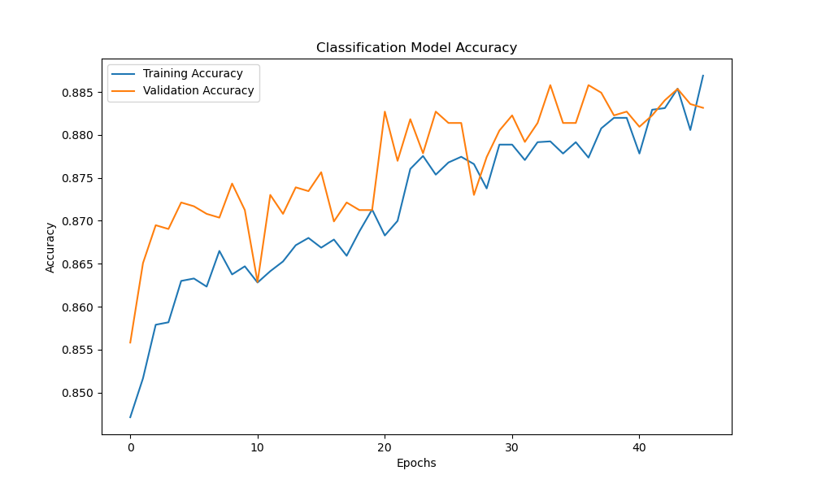

# Drought-Predictor-Neural-Network
Drought Predictor Neural Network
This project uses neural networks to tackle two tasks related to drought prediction: classification and regression. The classification model predicts whether drought conditions exist based on meteorological data, while the regression model predicts the exact Standardized Precipitation Index (SPI) values. The implementation relies on TensorFlow and Keras to define and train dense neural network architectures for both tasks.

